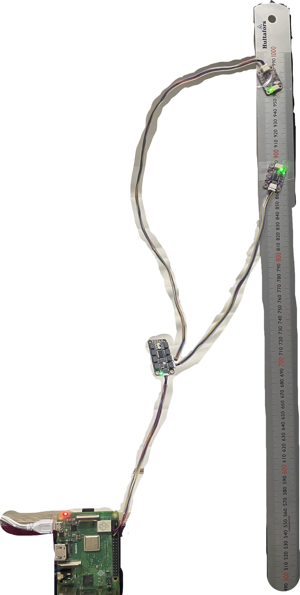

# Wind Turbine Mock Setup

## Purpose of the Mock Setup

The purpose of this physical setup is to act as a mock representation of a wind turbine (WT) foundation. It simulates the collection of vibration data in a controlled environment. The goal is to generate acceleration data from physical sensors that resemble the measurements collected from real WT structures.

Although the output of this setup is not used for operational decision making, it plays an important role in testing key components of the Digital Twin (DT) system. These components include data acquisition, calibration, processing, and real-time data streaming.

## Hardware Setup

Here is a photo of the mock physical twin.

and here is a system diagram illustrating the connections between components.

The physical setup consists of:

- Raspberry Pi 3 Model B+
- Two ADXL375 accelerometer sensors
- PCA9548 I²C multiplexer (enables connection of multiple I2C devices)
- A flexible mounting surface

The sensors are attached to a flexible ruler, which acts as a test structure. This structure can be subjected to vibration by applying airflow using a small fan, allowing the setup to mimic wind-induced structural movement.

Each of the ADXL375 sensors is connected to a separate channel on the PCA9548 I²C multiplexer, which in turn is connected to the I²C interface of the Raspberry Pi. This allows multiple sensors with the same I²C address to be used simultaneously by switching between them programmatically.
