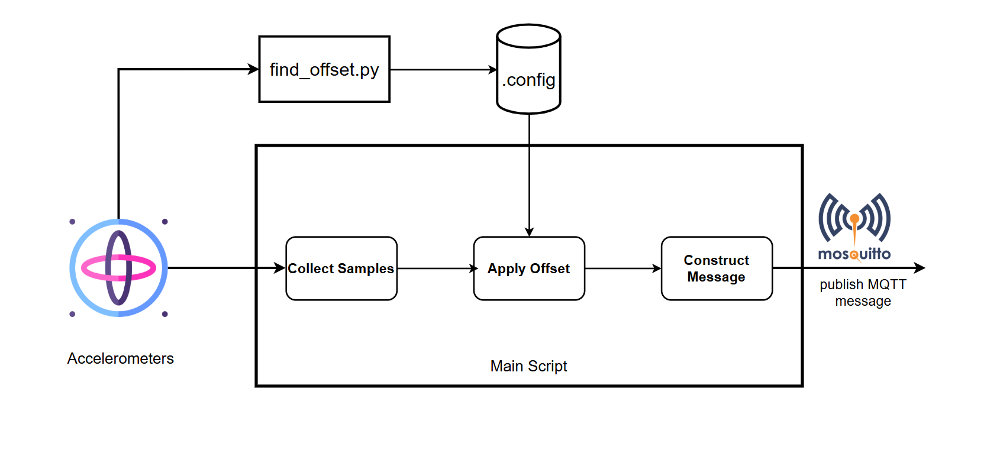

# Code Structure

The `mock_pt` module acquires data  from two ADXL375 accelerometers
over I²C and publishes their readings to an MQTT broker in a structured
binary format. The system is designed for real-time integration with
a digital twin workflow.

## Key Features

- Offset-based calibration for ADXL375 accelerometers
  using a separate calibration script
- Modular design using typed data classes (`SensorTask`, `Batch`)
- Real-time data acquisition and publishing to MQTT topic.

## Sensor Access via I²C Multiplexer

Each sensor is accessed by enabling its corresponding channel on
the TCA9548A I²C multiplexer. This is handled by
the `enable_multiplexer_channel()` function, which writes a control byte to
address `0x70`. For example, enabling `channel 0` sets the least significant bit.

Sensor initialization is done through the `setup_sensor()` function,
which creates and configures an ADXL375 instance. Channels must be activated
before sensor setup.

## Sensor Calibration Process

Each accelerometer sensor is calibrated to remove inherent bias before use.
The `find_offset.py` script is used for this purpose.
Before running the script, the sensors are placed on a stable surface.
Then the x-axis readings are collected continuously over a duration of
10 seconds for each sensor. The average of these readings is computed and
treated as the offset value, which represents the deviation from
the expected resting value of 0 m/s².
This offset represents the sensor's bias when resting and is used to correct
all subsequent readings.
This offset is stored in a configuration file (`config/offset.json`), which
is later used in the `publish_samples.py` script to correct raw readings.

## Data Acquisition and Publishing



The `publish_samples.py` script is responsible for the full acquisition and
publishing pipeline. It collects raw acceleration data from each sensor,
applies the corresponding offset from the configuration file
(`config/offset.json`), then formats a binary message and publishes it to
the MQTT broker.

Each message contains a descriptor and a payload of 32-bit floating point
acceleration values (in m/s²).

The descriptor contains the following fields:

- `descriptor_length (uint16)`
- `metadata_version (uint16)`
- `seconds_since_epoch (uint64)`
- `nanoseconds (uint64)`
- `samples_from_daq_start (uint64)`

The `seconds_since_epoch` and `nanoseconds` fields are set to zero in this
mock setup, as precise timestamping is not required.
The `samples_from_daq_start` counter increments with each published batch
and serves as a proxy for time.

In this setup, the sampling rate of the ADXL375 sensors is set to `20 Hz`,
but it can be adjusted according to the testing requirements.

The MQTT topic naming follows the structure:

```sh
cpsens/DAQ_ID/MODULE_ID/CH_ID/acc/raw/data
```

Each sensor publishes its data to a unique topic. This structure supports
organized data flow and facilitates integration with downstream components
in the DT system.

The overall data flow is illustrated in the figure above.

The data acquisition and publishing process is implemented in Python
and organized into modular functions. In the `publish_samples.py` script,
the function `collect_samples` is responsible for retrieving raw acceleration
readings from the sensor and applying the previously calculated offset.
The sensor is read `n` times (default 32), and the x-axis values are
corrected using the offset before being stored in a local list:

```python
def collect_samples(sensor, offset: float, n: int = 32) -> list:
    samples = []
    for _ in range(n):
        x = sensor.acceleration[0] - offset
        samples.append(x)
        time.sleep(0.005)
    return samples
```

Once a calibrated batch of samples has been collected, it is passed to
the `send_batch` function. This function first constructs a binary
descriptor containing descriptor length, metadata version, and
the number of samples collected since the start of acquisition.
In this mock setup, timestamp fields are not used and are set to zero.
The data samples are then encoded as an array of 32-bit
floating point values:

```python
descriptor = struct.pack("<HHQQQ", 28, 1, 0, 0, sample_counter)
data_payload = struct.pack(f"<{len(samples)}f", *samples)
```

Finally, the descriptor and data payload are concatenated into a single
binary message and published to the appropriate MQTT topic using quality
of service level 1:

```python
payload = descriptor + data_payload
mqttc.publish(topic, payload, qos=1, retain=False)
```

This structured messaging format ensures that each MQTT packet contains
both descriptor and sensor readings in a consistent and machine-readable
format.
